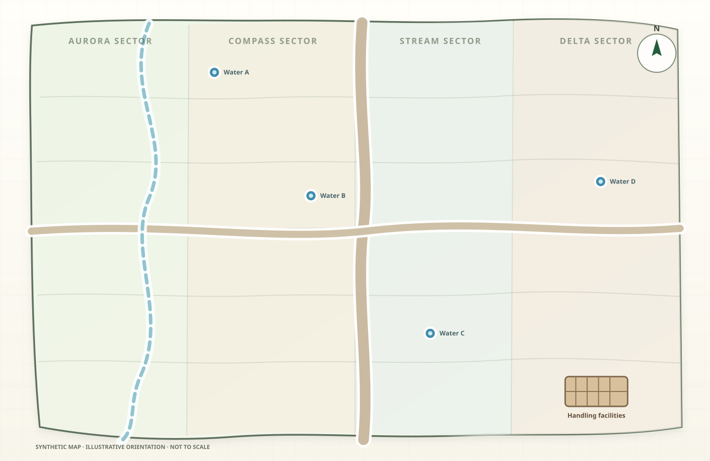
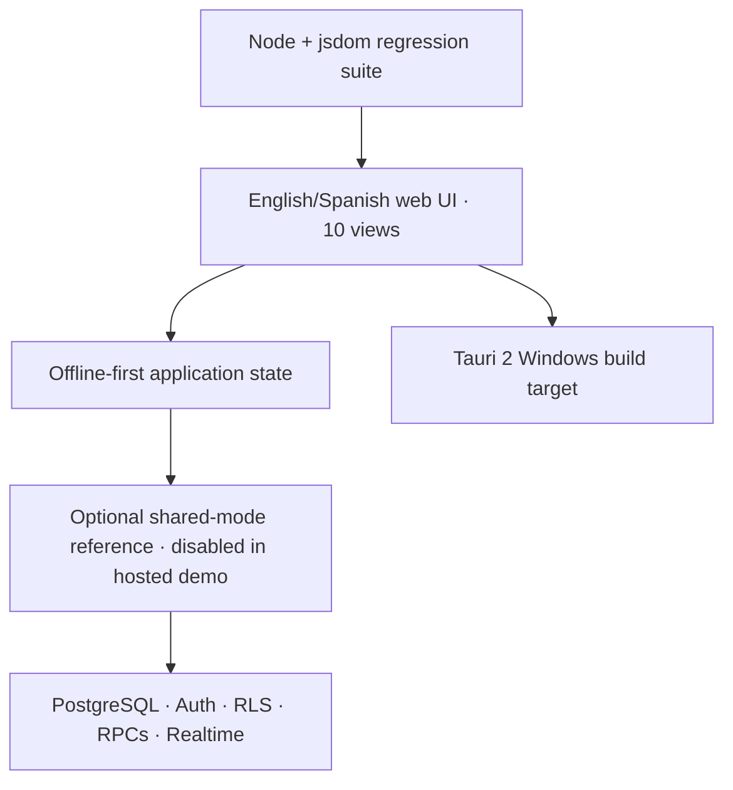

# AgroPlano — Livestock Operations & Grazing Decision Support

[](https://github.com/TomasKrick/Agroplano/actions/workflows/verify.yml)
[](https://github.com/TomasKrick/Agroplano/actions/workflows/build-windows.yml)
[](https://tomaskrick.github.io/Agroplano/)
[](LICENSE)

**AgroPlano** is a bilingual English/Spanish, offline-first application for
livestock operations: interactive field maps, traceable cattle movements,
grazing plans, work queues and decision-support indicators in one interface.

The public demo opens in English and can be switched to Spanish from the
header. It uses a deterministic synthetic farm, fictional herds and artificial
SVG geometry.

> **Synthetic data only · not for operating a real farm.** This is a separate,
> privacy-sanitized public portfolio edition built from selected generic
> workflows and architecture of a private system used in a real agricultural
> operation. It is not the production repository and does not claim
> feature-for-feature parity. No production data, geometry, identifiers,
> credentials, backend configuration, exports or private Git history are
> included.

[**Launch the live demo**](https://tomaskrick.github.io/Agroplano/)
· [English user guide](docs/USER_GUIDE.md)
· [Guía en español](docs/GUIA_DE_USO.md)
· [Privacy boundary](docs/PRIVACIDAD_Y_SEPARACION.md)



## 60-second product tour

1. Open the live demo; it starts in English. Use **English / Español** in the
   header to switch language.
2. In **Map**, hover over a lot and open its operational record.
3. In **Livestock**, inspect entries, transfers, completed sales and mortality.
4. In **Grazing**, filter the timeline and review rest versus target.
5. In **Dashboard**, inspect occupation, head-days/ha and inventory consistency.

Edits stay in your browser. Use **More → Reset data** to restore the synthetic
scenario.

## The problem

Livestock operations must reconcile several kinds of state that are usually
split across paper, spreadsheets and chat:

- where every herd is now and where it has been;
- whether a movement changed both origin and destination consistently;
- grazing occupation, rest and planned work through time;
- stock reductions caused by sales or mortality;
- which records are trustworthy enough to support a decision.

AgroPlano joins spatial, temporal and inventory data in one traceable workflow.
It is designed for a small operational team that needs low-friction data entry
and useful feedback, not another reporting system maintained after the fact.

## What this repository demonstrates

I owned product direction and delivery end to end, and worked hands-on on
implementation, debugging, testing, documentation and releases:

- translated farm routines into a data model, ten operational views and
  acceptance criteria;
- defined and validated movement rules, eligibility-checked reversals, role
  boundaries and data-quality guardrails;
- defined decision metrics such as occupation, rest-versus-target,
  head-days per hectare, plan adherence and inventory consistency;
- designed a bilingual presentation layer that does not rewrite stored domain
  values, imports, exports or shared state;
- separated this portfolio artifact from the private operating system through
  synthetic fixtures, independent identifiers and privacy tests.

**Author:** [Tomás Krick](https://github.com/TomasKrick)

### Private deployment context

Separately, I led the development and rollout of a private application used by
a small Argentine agricultural team. My role included requirements and
workflow modeling, hands-on implementation and debugging, user validation,
Windows packaging, layout testing at 1366×768, and installation and
synchronization checks across multiple PCs. That repository, its operational
data and its backend remain private; this public edition retains only generic
product logic that is safe to show. It replaces operational data, geometry,
identity, configuration, backend and Git history with synthetic or isolated
public equivalents.

## Product surface

| Area | What it supports |
|---|---|
| Interactive map | Search, zoom, pan, layered status views and contextual lot cards |
| Cattle operations | Entry, transfer, exit, sale and mortality against the exact open occupation |
| Herd traceability | Current location, stock and chronological route across lots |
| Grazing planner | Real and planned periods, multiple herds per field, filters, zoom and rest-versus-target |
| Operations center | Pending work, history, status transitions and analysis by field, herd, category and owner |
| Decision support | Occupation, rest, head-days/ha, plan adherence, priorities and consistency checks |
| Audit and recovery | Movement records retained after eligibility-checked reversal, with user, date and required reason |
| Distribution | Browser-local PWA, configured Tauri 2 Windows build targets and an optional Supabase reference deployment; the hosted demo has no backend |

## Architecture



### Stack

- Vanilla JavaScript, HTML, CSS and SVG for a zero-build portable interface.
- Tauri 2 and Rust for native Windows packaging.
- Supabase/PostgreSQL for optional Auth, RLS, transactional RPCs, optimistic
  concurrency and Realtime updates.
- Node.js and jsdom for deterministic privacy, DOM and regression checks.
- GitHub Actions for CI, Windows builds and the public web demo.

### Important engineering decisions

1. **Offline first.** Core public-edition workflows run locally without an
   account or network connection. Cloud synchronization is an optional
   reference deployment.
2. **One traceable movement.** A transfer closes the source occupation and
   opens the destination as one application command with rollback on failure;
   sales and mortality update both stock and history.
3. **Explicit consistency over silent repair.** Invalid dates, ambiguous herds
   and conflicting occupations are rejected or marked for review.
4. **Deterministic synthetic fixture.** The public dataset exercises
   multi-herd occupation, long time ranges and KPI edge cases without copying
   any production record.
5. **Deliberate small-team trade-off.** Shared state is versioned as a JSON
   document with idempotent mutations and optimistic concurrency. This keeps
   deployment simple for a few operational users; a higher-volume analytical
   product should normalize the event model further.
6. **Presentation-only localization.** The language layer translates rendered
   UI and accessibility text without rewriting catalogues, movements, imports,
   exports or synchronized state.

## Run locally and verify

The [live demo](https://tomaskrick.github.io/Agroplano/) stores edits only in
your browser. To run the same source locally, use Node.js 20.19 or later:

```bash
npm ci
npm run serve
```

Then open `http://localhost:4173`.

Run the complete check suite:

```bash
npm test
```

The suite verifies the synthetic fixture, ten views, both interface languages,
language persistence, movement invariants, responsive layout contracts,
public-file allowlists, icon validity and common secret/coordinate patterns.

## Windows application

The **Build Windows** workflow is configured to produce a portable executable
plus NSIS and MSI installers with the independent identity
`com.agroplano.demo`. Artifacts are treated as releasable only after a green
Windows run. See
[installation and updates](docs/INSTALACION_Y_ACTUALIZACION.md).

## Optional shared mode

Shared mode is disabled by default. The optional reference deployment requires
a dedicated Supabase project and the migration in
[`supabase/migrations/001_agroplano_shared_state.sql`](supabase/migrations/001_agroplano_shared_state.sql)
and test users created in Supabase Authentication.

The optional reference deployment supports three roles:

- **Administrator:** data, catalog and member administration.
- **Editor:** operational writes without permission management.
- **Viewer:** read-only access.

Only a publishable/anon client key belongs in a client build. Never use a
service-role key or another application's backend. See
[Supabase setup](docs/SUPABASE_OPCIONAL.md).

## Scope and limitations

- This is an operations and decision-support project, not a machine-learning
  system.
- The single-file UI is a pragmatic choice for offline portability; a larger
  engineering team should split it into modules and add browser-level E2E
  tests.
- The synthetic clock is anchored to a reproducible scenario, so the demo
  always presents the same evidence.
- The public edition reproduces representative workflows, not every feature or
  deployment detail of the separate private system.
- English/Spanish localization covers the interface; persisted domain values
  and exported records retain their stable source values.
- The hosted demo is browser-local. Shared mode is reference infrastructure
  that requires a dedicated Supabase deployment and integration testing.
- Cloud and SQL integration still require deployment-specific tests before
  real use.

## Privacy and license

The public/private separation is part of the design, not a disclaimer added
afterward. See [PRIVACY.md](PRIVACY.md),
[the separation policy](docs/PRIVACIDAD_Y_SEPARACION.md) and
[the synthetic-data design](docs/DATOS_FICTICIOS.md).

Released under the [MIT License](LICENSE).

## Resumen en español

AgroPlano integra mapa, hacienda, rodeos, pastoreo, tareas e indicadores en una
aplicación local con interfaz en inglés por defecto y opción persistente en
español. Esta edición pública es funcional y editable, pero independiente del
sistema privado: usa exclusivamente geometría y datos ficticios y no afirma
paridad función por función. La [guía de uso](docs/GUIA_DE_USO.md) explica cada
flujo.
